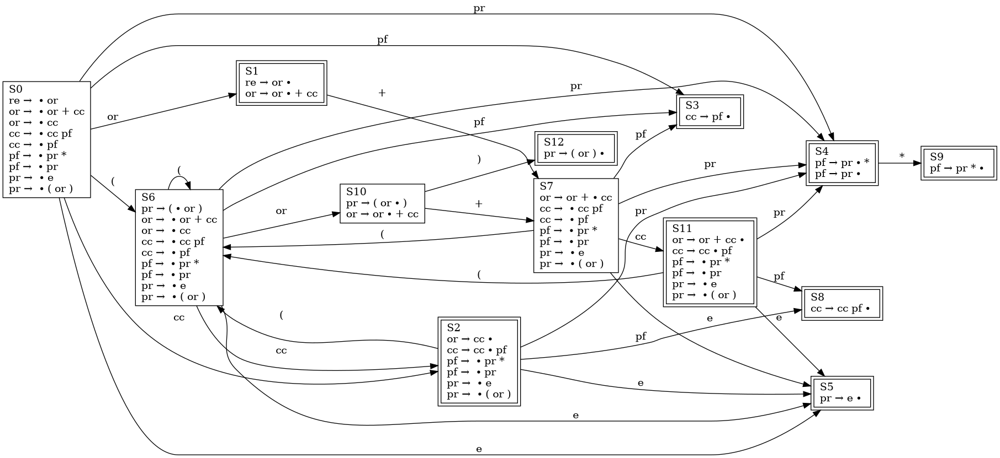

# ToC-RE-Helper

<p align="center">
  
</p>

## Intro

This is the final project for the course "**Theory of Computation**". The project aims to help those who are also participating this course but had a hard time understanding the concept of **regular expression** and **NFA** (non-deterministic finite automata).

The LINE bot **ToC-RE-Helper** would help you transform an **RE** you learned in the class into an equivalent **NFA**. Also, it is capable of performing optimization on your input to minimize the number of states and transitions. Finally, once the **NFA** is generated, you can try giving it an input string and see whether the **NFA** can accept it or not!

### Bot basic ID

- @846cqgxg

### QR code

<p style="text-align: center"></p>

* Scan the QR code and add the bot **ToC-RE-Helper** official account as your friends.
* Select **RE to NFA** on the main menu to start crafting your **NFA**!
* If having trouble, you can see the **Help** content by clicking the help option on the main menu.

## Demo

### RE to NFA


* An intuitive and straightforward way of constructing an NFA from RE.
* Easy to understand the structure of the NFA.
* Has only one single final state.

### RE to NFA (optimized)


* Optimize the NFA generation of all kinds of regular expression operator.
* Minimized number of states and transitions.
* Has multiple final states.


### Match


* You can use **Match** to test the NFA you crafted.
* It tells you whether the input string you entered can be accept by the NFA or not.

### Help


* A simple help page is provided to give you more information about NFA and RE.
* It shows the relation of an RE expression between the corresponding NFA component.
* You can also get the detailed control flow state machine diagram and the characteristic finite state machine diagram of RE parser in the help page.

## Features

### For users

* **Easy to use**
  * ToC-RE-Helper provides clean, beautiful and friendly UI.
  * All the functionalities are super easy to use.

* **Same regular expression grammar as you had learned in the ToC course**
  * The regular expression is the same as what you had learned in the class.
  * It help you to get started with ToC-RE-Helper much faster.

* **Able to simulate NFA transitions and match an input string**
  * Besides constructing an NFA, you can also give it an input string and see if it can be accepted by your NFA.


### For developers

* **Hand crafted regular expression compiler**
  * The compiler is written base on the knowledge learned from the course [**Compiler Construction**](http://class-qry.acad.ncku.edu.tw/syllabus/online_display.php?syear=0110&sem=2&co_no=F732400&class_code=).
  * The frontend RE parser and backend NFA generator are separated as the modern compiler design methodology does.
  * Use bottom-up parsing to check the syntax of regular expression.
  * An [intermediate representation](https://github.com/yuyuranium/ToC-Project-2021-re2nfa-bot/blob/f60f81d6bc47232a30aad24c8f09a9e812bf3e95/lib/re-compiler.js#L771) is generated to describe how the NFA is to be build.

* **Stack based NFA generator**
  * The generator takes the IR as input and generate a corresponding NFA based on the description.
  * The generator can be considered as a stack virtual machine and the IR is the instruction sequence.
  * The operation on the RE can be mapped to the construction on the NFA directly.

* **NFA optimization for minimal states and transitions**
  * In addition to an intuitive way of constructing an NFA, the generator can also do optimizations.
  * It generates two times less states and transitions than the intuitive way on average .

* **Minimal source codes**
  * There are only 2 source files in this repo, one for the server and the other for the RE compiler.


## FSM

There are two **finite state machine**s in my program, one for recording current user status and the other for the regular expression parser in the re-compiler.

### Control flow FSM


This is the FSM to record the status of a active user. There are mainly 6 states for an active user, which are

* `initial`
* `waitingReInput`
* `hasReInput`
* `gotNfa`
* `waitingStringToMatch`
* `waitingHelpType`

In any state, user can go to any of `initial`, `waitingReInput` or `waitingHelpType` without restraint via `restart`, `re2nfa` or `help` transition respectively, which maps to the clicking on the button of the **template messages** sent by the bot.

The transition like `reInput` or `stringToMatch` correspond to the text input of user. `correctReInput` and `incorrectReInput` is triggered by the compilation result of user's RE input. As for all the help options, those transitions all go back to the `waitingHelpType` since the user can consecutively ask for different help contents.

Once the user clicks the button that triggers `re2nfa` or `help` transition, then the user information is record in an **active user list**. On the contrary, if the user triggers `restart` transition, then he or she would be moved out from the list.

### CFSM of RE parser



The state machine is the core of [regular expression compiler](https://github.com/yuyuranium/ToC-Project-2021-re2nfa-bot/blob/main/lib/re-compiler.js). The parser is a implementation of **button-up** parser, which is capable of parse the input using a SLR(1) grammar. The [parser driver](https://github.com/yuyuranium/ToC-Project-2021-re2nfa-bot/blob/0d7d45ae109dc13acd538a439ca38cbbe9c99a46/lib/re-compiler.js#L181) is driven by the parse table derived by the CFSM and performs **shift-reduce** parsing on the input token string. For more detailed information, please refer to [here](https://github.com/yuyuranium/ToC-Project-2021-re2nfa-bot/blob/main/lib/README.md).

## Deployment

### Framework

<p align="center">
  
</p>

<p align="center">
  
</p>

The framework of this bot is based on [Node.js](https://nodejs.org/en/) and [Express](https://expressjs.com/zh-tw/). Besides, [npm](https://www.npmjs.com/) is used as the package manager.

### Dependencies

The dependent packages are recorded in `packages.json`. To install them, do

```bash
$ npm install
```

### Prerequisite

Create a line channel and get the `channel_id`, `channel_secret` and `channel_access_token`. Also, get an [imgur](https://imgur.com/) account and register an **application**, which is used to upload the generated diagram and obtain the link to the it to send an image message in LINE. You will also get an `client_id` for your imgur application. Finally, create your own `.env` file according to the format described in `.env.sample` then you're ready to go.

### Activate the server

To activate the server, simply do

```bash
$ node app.js
```

The server listen on the port `6459/` by default. You can specify the port by your own [here](https://github.com/yuyuranium/ToC-Project-2021-re2nfa-bot/blob/b1d8363f8c4b4e8197153cf174adf1f28f4abdbf/app.js#L13). Also, remember to set the webhook url for your LINE messaging api.
